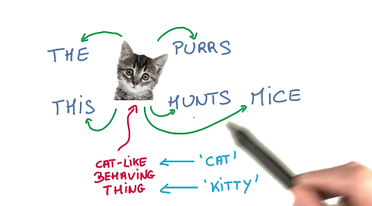
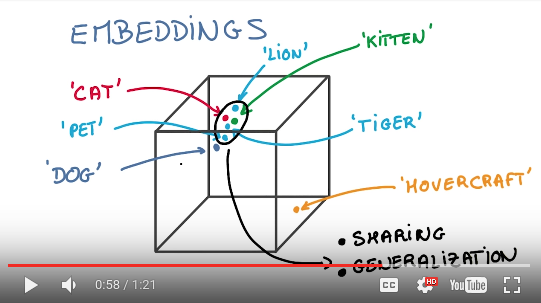
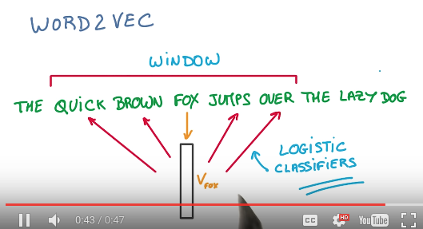
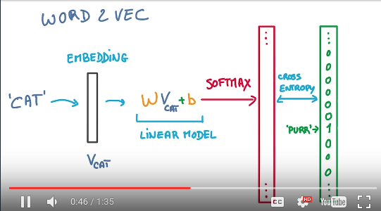
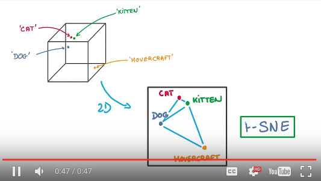

Udacity上有一个Google技术人员提供的基于Tensorflow的深度学习课程，今天学到Embedding，有点难理解，所以写个笔记记录下，以备日后回忆。

Udacity课程视频：https://classroom.udacity.com/courses/ud730/lessons/6378983156/concepts/63742734590923#

例子Github地址：https://github.com/tensorflow/tensorflow/blob/master/tensorflow/examples/udacity/5_word2vec.ipynb

## 一个小debug

这个例子里用到了sklearn的tSNE来降维作显示，但每次运行到这里Jupyter都提醒Kernel死掉了，Kernel重启。于是把源码复制到单独python文件里执行，看到如下错误：
```
Intel MKL FATAL ERROR: Cannot load libmkl_avx2.so or libmkl_def.so.
```
这个问题似乎是Intel的MKL有问题，网上查到这篇[为Anaconda2.5提供MKL优化][1]，里面也提供了去掉MKL优化的方法：
```
conda install nomkl numpy scipy scikit-learn numexpr
conda remove mkl mkl-service
```
执行过之后，就去除了mkl库，import mkl就找不到了，同时例子程序里的问题也没有再出现。
如果还是想使用Intel MKL优化的话，或许可以参考Anaconda官方文档[MKL OPTIMIZATIONS][2]来重新安装过。不过，我先不装了。

## 解决完程序安装的问题，开始理解课程：

- 课程使用的实现无监督文本学习的根据：**相似的词，会伴随相似的上下文**。
（我记得有人说过，看一个人的朋友，就知道这个人大致是怎样，看来词也一样。）如下图：



- Embeddings的目标，就是把词都放到一个向量空间里去，这样相近的词就聚集在一起。有了这个模型以后，就可以做很多应用，例如找近义词、某一类词聚类、甚至进行向量加减来寻找衍生词。如下图：



- 如何建立这个Embeddings呢？首先使用一个工具叫word2vec。word2vec算法描述是这样，载入句子，从句子中取出一个词，例如FOX，将他放入Embeddings向量空间（最初位置肯定是随机的），然后通过一次逻辑回归分类预测出他对应的词语，然后与文中实际的QUICK BROWN JUMPS OVER四个词比对，并修正他在Embeddings向量空间里的位置。反复上述步骤，便可得到Embeddings向量空间。（TODO:我这段还需要再理解下）如下图：



- 再来看一下word2vec的具体流程图：把词`cat`放进Embeddings向量空间，然后做一次线性计算，然后取softmax，得到一个一批0-1的数值，然后cross_entropy，产出预测词`purr`。跟目标比对，然后调整。这就是训练过程。如下图：



- 因为Embeddings向量空间是高维的（TODO:具体几维？），要想直观的看到他，可以使用t-SNE降维技术，这个技术据说比原始的PCA降维要先进，能保留更多信息。




## 理解完课程，然后来读例子程序：

[点此查看notebook][3]

未完待续

[1]:https://www.continuum.io/blog/developer-blog/anaconda-25-release-now-mkl-optimizations
[2]:https://docs.continuum.io/mkl-optimizations/
[3]:https://github.com/tensorflow/tensorflow/blob/master/tensorflow/examples/udacity/5_word2vec.ipynb
